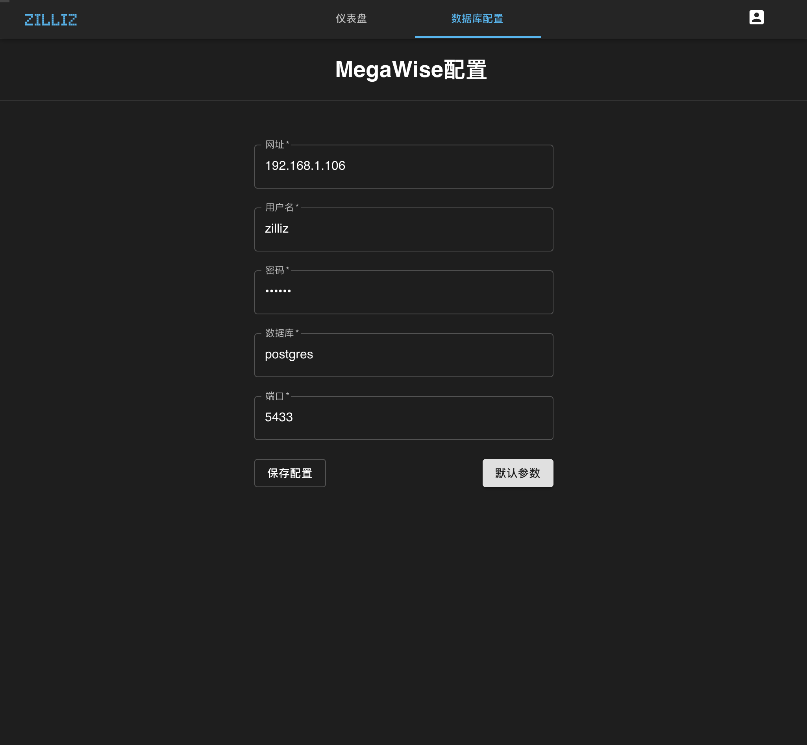

# 安装 Infini 可视化组件

## 安装前提

1. 请确认已安装以下软件
   - [Docker 19.03 or higher](https://docs.docker.com/engine/installation/linux/docker-ce/ubuntu/)
   - [Docker Compose](https://docs.docker.com/compose/install/)
2. 请确认已安装 MegaWise ，开启MegaWise服务并导入示例数据
   - [安装 Megawise](install_infini_sql.md)


## 使用 Docker Compose 运行 Infini 

1. 确保 docker-compose 正在运行 

   ```bash
   $ docker-compose --version
   ```

    如果终端能够显示 docker-compose 的版本信息，则说明系统中已经安装有对应版本的 docker-compose。在如下的示例中 docker-compose 的版本为1.24.1。
    ```
    docker-compose version 1.24.1, build 4667896b
    ```
2. 下载两个配置文件到同一文件目录

   ```bash
   $ wget https://raw.githubusercontent.com/Infini-Analytics/infini/master/config/webserver/.env \
   https://raw.githubusercontent.com/Infini-Analytics/infini/master/config/webserver/docker-compose.yml
   ```

3. 修改 `.env` 文件

   > <font color='red'>注意：请把 `192.168.1.60` 改成当前运行 Infini docker 的服务器 ip 地址
   >
   > 请把 `192.168.1.106` 改成当前运行MegaWise docker 的服务器 ip 地址。</font>

   ```yml
   # 默认API服务地址
   API_URL=http://192.168.1.60:9000
   # 默认web服务端口
   LOCAL_PORT=80
   # megawise ip
   MEGAWISE_HOST=192.168.1.106
   # megawise 用户名
   MEGAWISE_USER=zilliz
   # megawise 密码
   MEGAWISE_PWD=zilliz
   # megawise 数据库
   MEGAWISE_DB=postgres
   # megawise 端口
   MEGAWISE_PORT=5433
   ```

4. 启动 Infini web server

   ```shell
   # start Infini
   $ docker-compose -f docker-compose.yml up
   ```

5. 修改 host，打开 `/etc/hosts` 文件，添加以下一条
   > <font color='red'>注意: 请把 `192.168.1.60` 改成当前运行Infini docker 的服务器 ip 地址
   >
   >  若使用windows系统查看Infini界面，则在C:\Windows\System32\drivers\etc\hosts文件中添加 </font>

   ```shell
    #/etc/hosts
    192.168.1.60 infini
   ```


6. 打开任意浏览器，优先支持 Chrome 和 Firefox

   ```shell
   # 如果修改了80端口，请加上端口号
   http://192.168.1.60
   ```


## 可视化界面

现在可以看到登录界面


**输入用户名和密码进行登录：**

- 用户名: zilliz
- 密码: zilliz

## 填写Megawise数据库信息
登录后，输入相关信息后，点击保存，界面就会跳转到仪表盘页面




单击New York Taxi Boards，出现以下界面


如果你可以看到以上界面，说明Infini 可视化组件已经成功启动了  


## 关闭 Infini 可视化组件

```bash
# Stop Infini
$ docker-compose -f docker-compose.yml down
```
