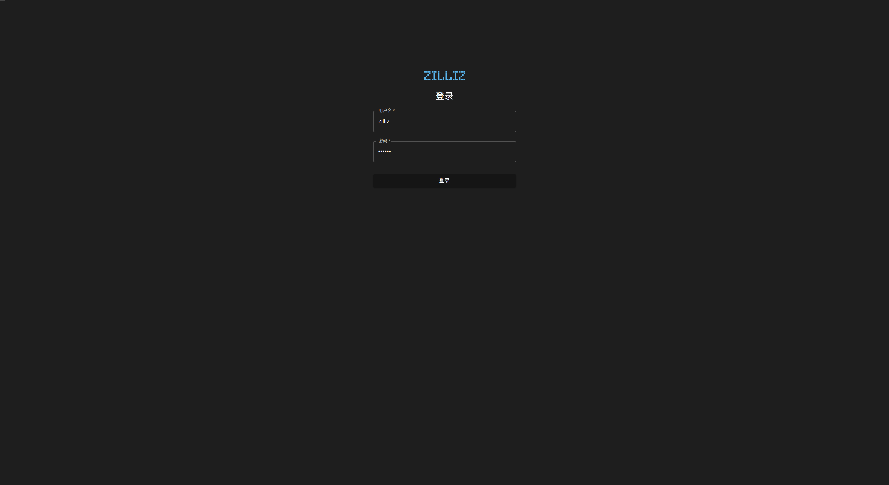

# 2. 安装 Infini 可视化组件

## 2.1 安装前提

1. 请确认已安装以下软件

    - [Docker 19.03 or higher](https://docs.docker.com/engine/installation/linux/docker-ce/ubuntu/)
    - [Docker Compose](https://docs.docker.com/compose/install/)

2. 请确认 Megawise 已经被安装，并示例数据已经导入
    - [安装 Megawise](install_infini_sql.md)

## 2.2 使用 Docker Compose 运行 Infini 可视化组件

1. 确保 docker-compose 正在运行 

   ```
   docker-compose --version
   ```

   如果 docker 服务没有被列出，请启动 Docker 

   > 注意: 在 linux 上, Docker 需要 sudo 权限.

2. 下载如下两个文件到同一文件目录
  - [docker-compose.yml](https://github.com/Infini-Analytics/infini/blob/master/config/webserver/docker-compose.yml)
  - [.env](https://github.com/Infini-Analytics/infini/blob/master/config/webserver/.env)
  
3. 修改 `.env` file 
    ```yml
    # 默认web服务端口
    LOCAL_PORT=80
    # megawise ip
    MEGAWISE_HOST=l92.168.1.1
    # megawise 用户名
    MEGAWISE_USER=zilliz_support
    # megawise 密码
    MEGAWISE_PWD=zilliz
    # megawise 数据库名称
    MEGAWISE_DB=gis
    # megawise 端口
    MEGAWISE_PORT=5432
    ```

4. 启动 Infini web server.

   ```shell
   # start Infini
   $ docker-compose -f docker-compose.yml up
   ```

5. 打开任意浏览器，我们优先支持 Chrome 和 Firefox

   ```shell
   # 输入inifi安装的机器的ip或者host地址，默认是80端口
   # 如果您修改了80端口，请加上端口号
   http://ip_or_host_where_infini_installed
   ```

  #### 现在可以看到登录界面
  

  #### 输入用户名和密码进行登录
  - 用户名: zilliz
  - 密码: zilliz

  如果你可以看到如下界面，说明我们已经成功了
  
  

6. 关闭 Infini 可视化组件
  ```shell
   # Stop Infini
   $ docker-compose -f docker-compose.yml down
  ```
