# Infini Analytics Quickstart

#### 登录
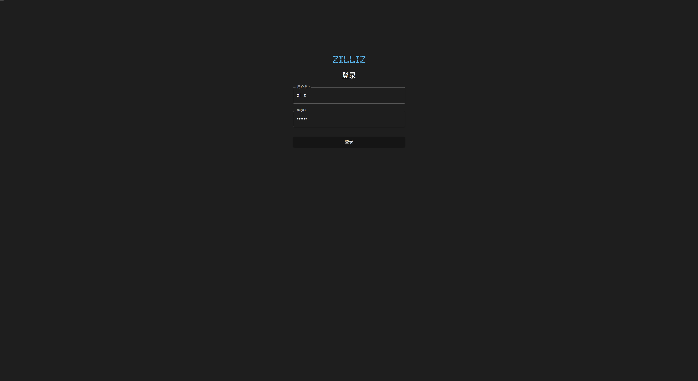

#### 配置数据库
输入合理的数据库配置信息，包括：服务器地址，用户名，密码，数据库名，端口，
也可点击右下角默认参数一键填充。
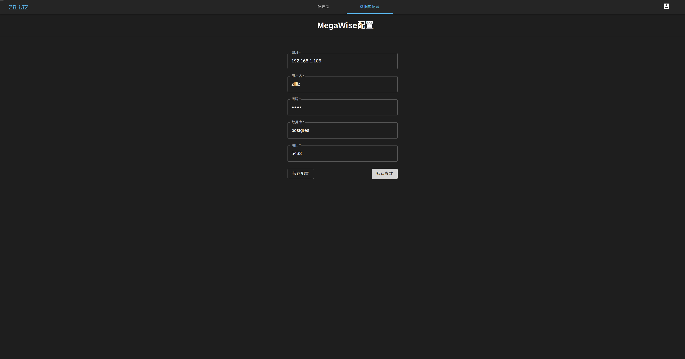
配置成功后自动跳转到仪表盘列表界面。
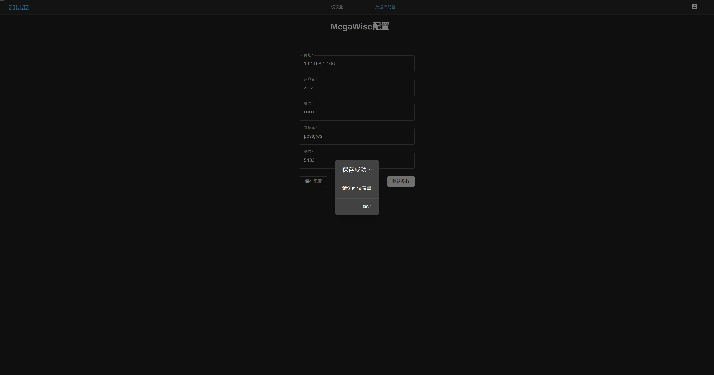
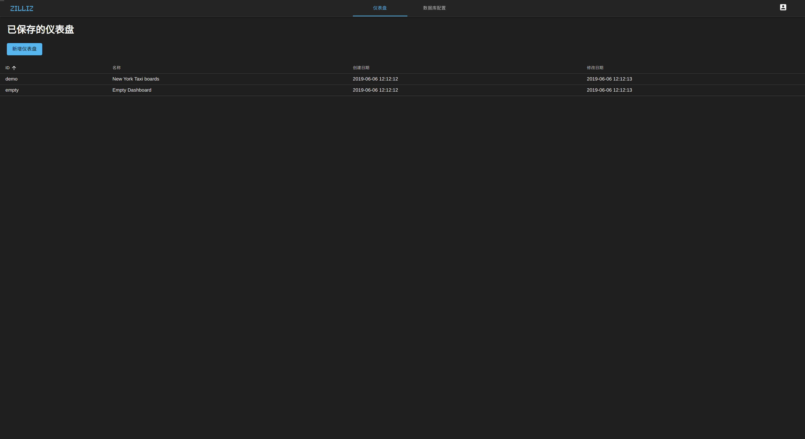

#### 新建仪表盘
点击‘新增仪表盘’，创建新的仪表盘

点击默认名称进行修改，名称会自动保存
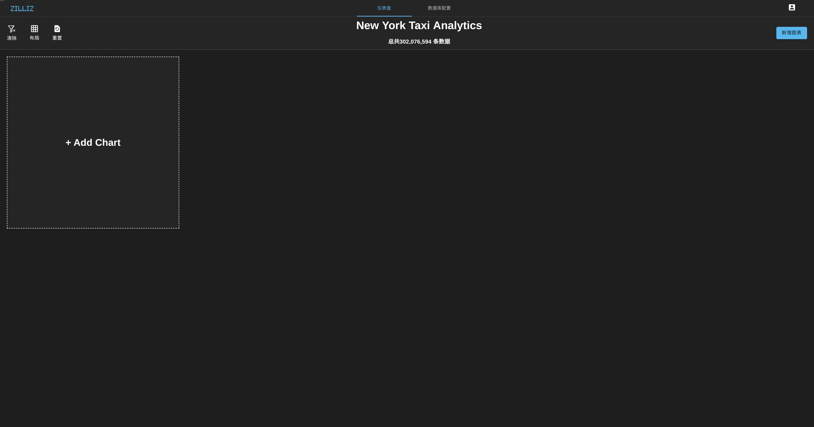

#### 添加数图
选择要展示的数据表。鼠标悬浮在选项上即可查看相关数据表信息，包括整体数据量，字段数，字段名称，字段类型等。
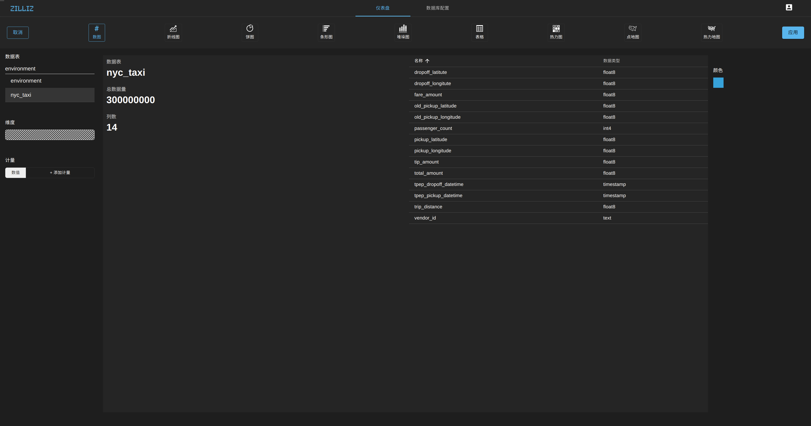
选择要查看的字段名称。
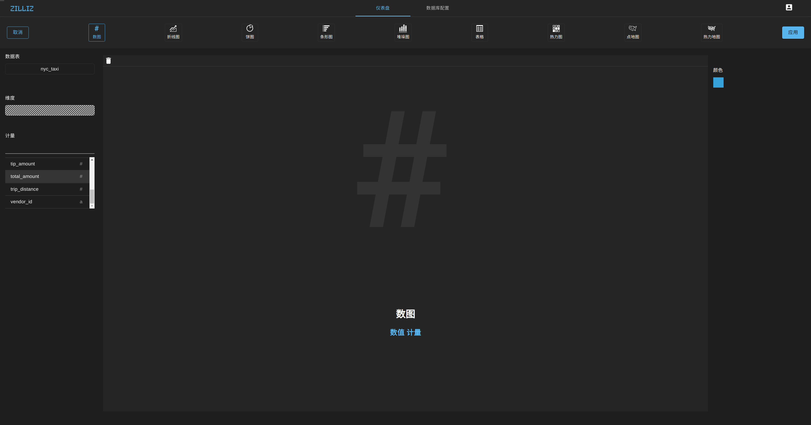
选择要展示的计量类型，当前支持平均值、最大值、最小值、总和、唯一值、标准差。
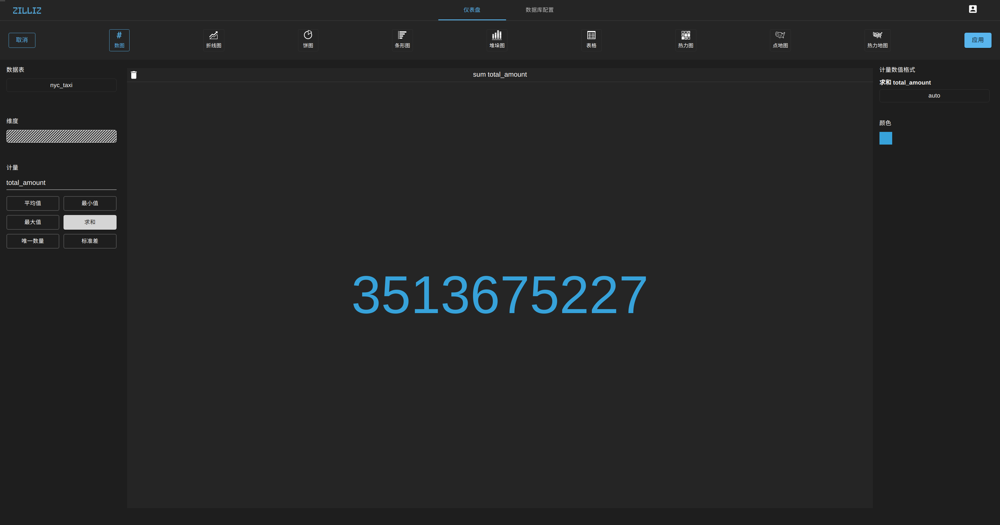
数据显示后可选择数据的展示格式，当前支持整数、浮点数、科学计数法等展示类型。
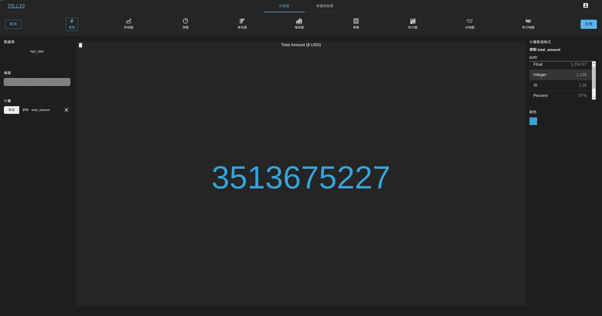
点击应用即可保存图表到仪表盘。
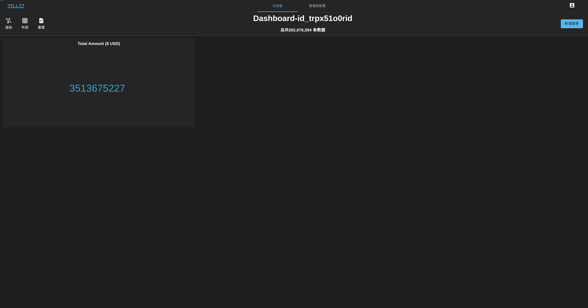

#### 添加饼图
按照相同的方式，添加饼图
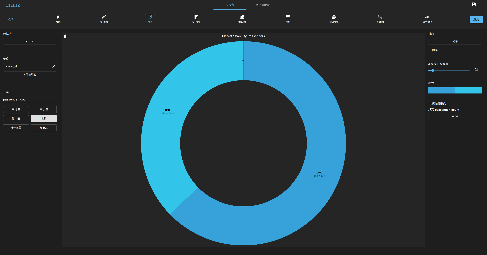

#### 添加折线图
折线图的维度支持时间类型和数据类型。
时间类型可按照不同的时间段长度进行分组
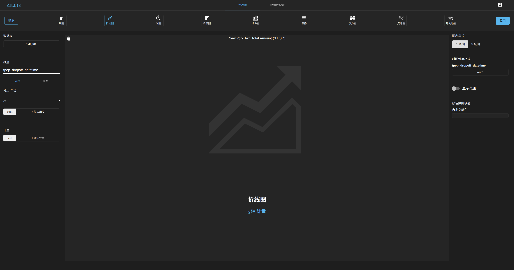
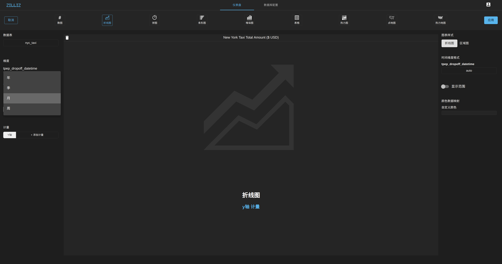
时间类型还支持按照特定时间进行抽取
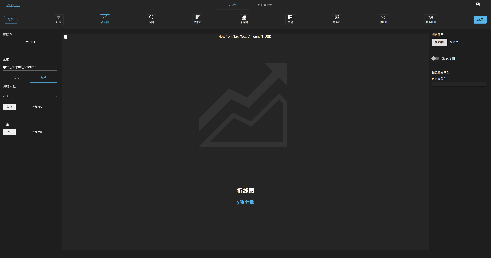
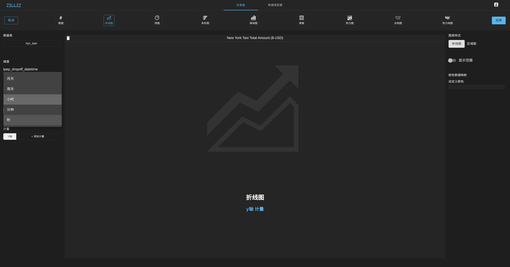
图表没展示前，会提示你还有那些选项必选，选中后即可展示图表。如下图，我们还需选取计量字段。
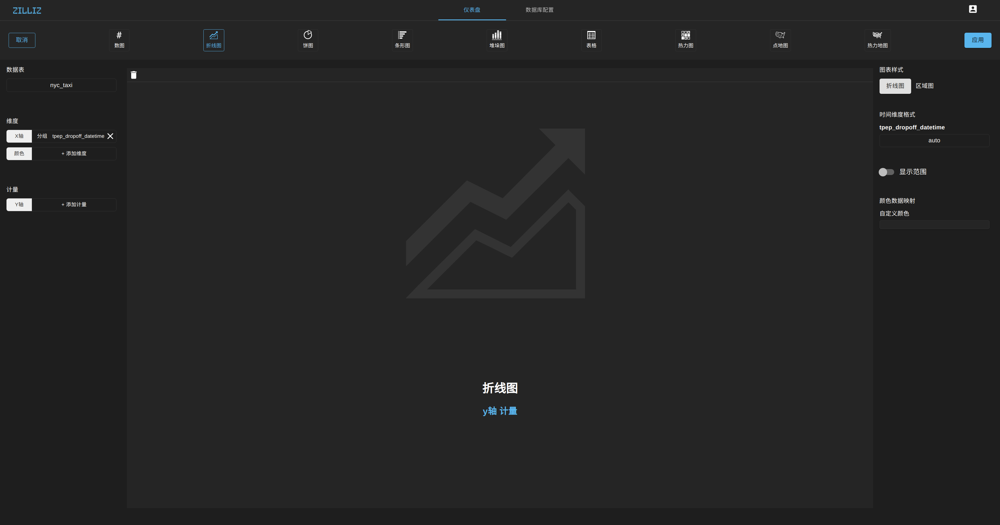
图表展示后，可根据右侧边栏对图表的展示进行配置，包括图表样式，颜色，展示范围等等。
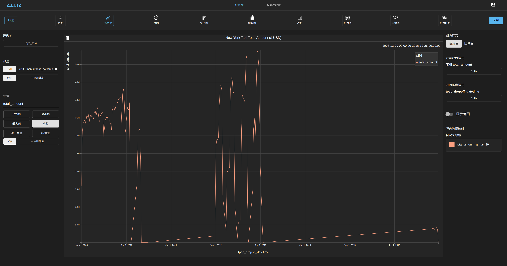

#### 添加点地图

#### 一键布局
Infini当前支持4种一键布局方式，可选择自己需要的方式，或直接对图表拖拽设置自己自定义布局
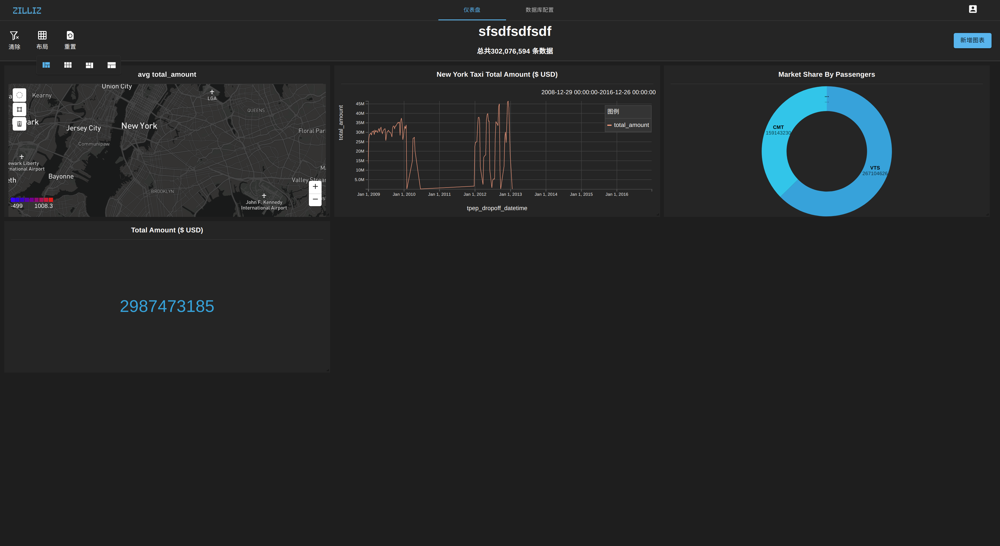
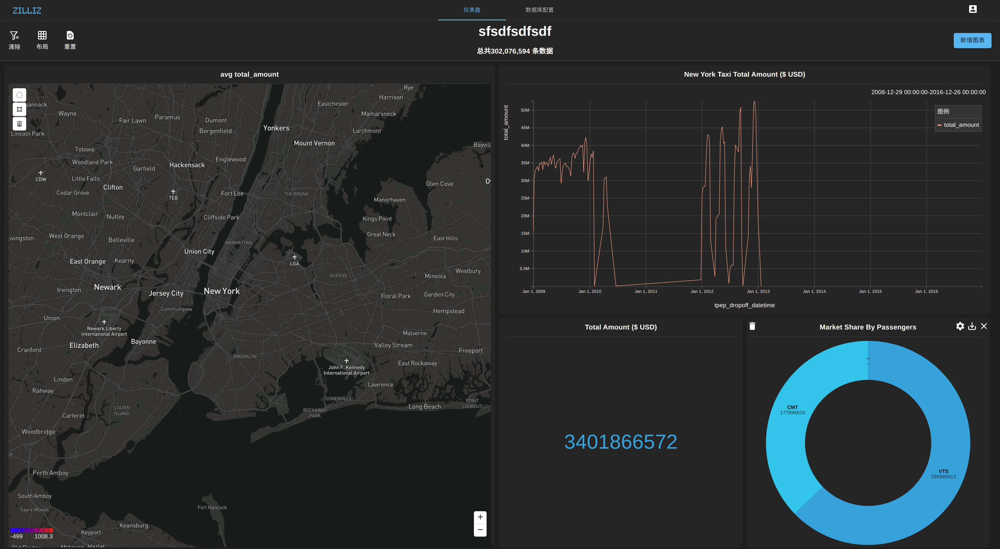

