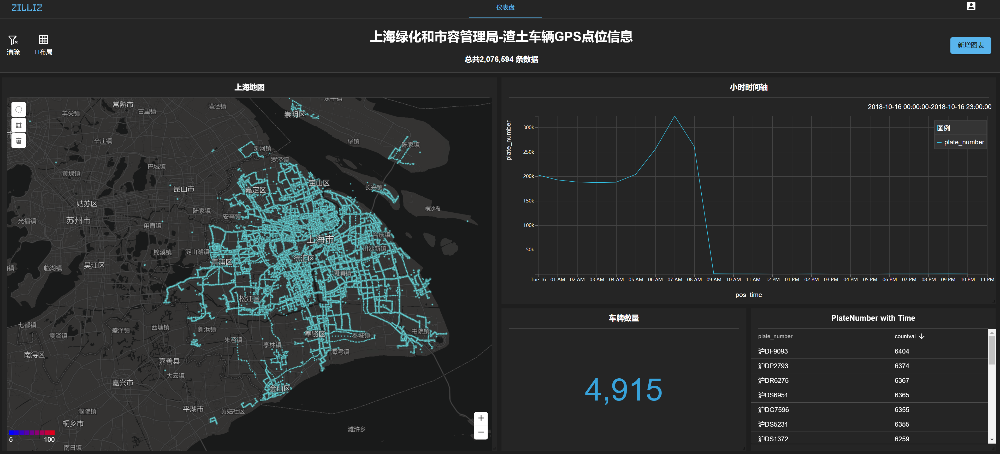
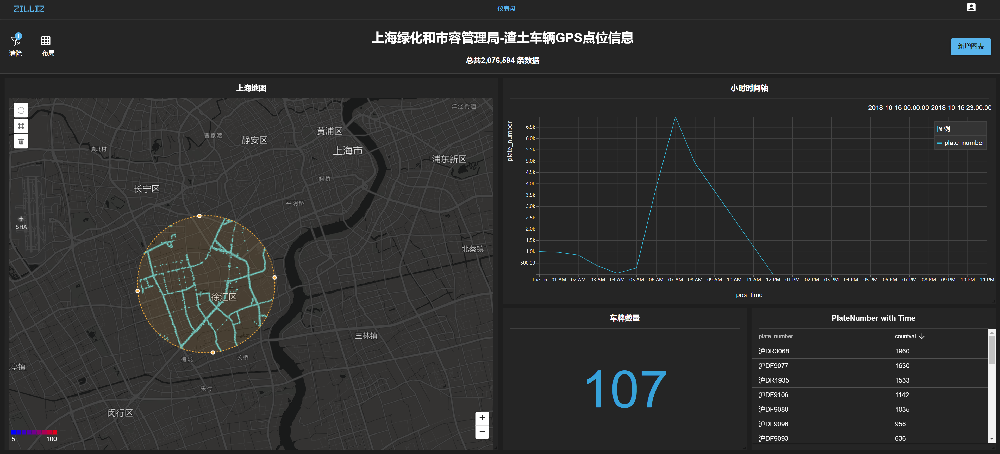

# Infini Analytics

随着数字化的不断深入，“数据”在人类生活中所扮演的角色日益重要。毫不夸张的讲，我们今天所处的正是一个数据时代。也由此催生了人们对数据分析，数据智能的强烈需求。人类对世界的认识、对社会的管理，都需要通过无所不在的数据进行驱动。伴随革命性的 5G 通信技术，这个时代的数据风暴正变得越来越猛烈：

- 数据量爆发式增长，2018 ~ 2025 数据量至少增长 6 倍
- 数据连接数量指数级，跨越式增长。4G 网络连接密度约 1,000 Connection / KM2 ，5G 网络连接密度约 1,000,000 Connection / KM2

然而，根据从大数据处理中得到的经验，倍增的数据，并无法带来倍增的价值。数据量越大，价值密度可能越低。另一方面，传统的计算引擎 CPU 的算力增长曲线已逐渐放缓，CPU 上的摩尔定律几近失效。继续用传统方法与工具进行数据分析处理，不论在性能，还是成本上都将使企业无法承受。

为帮助企业用户应对数据时代新的挑战，ZILLIZ 公司设计研发了新一代海量时空数据可视化分析引擎 Infini Analytics ，具有完整的自主知识产权。Infini Analytics 率先使用图形处理单元（ GPU ）的大规模并行处理和视觉渲染能力进行数据可视化呈现。与传统方案相比，Infini Analytics 平台具备高吞吐、高性价比、低延时三重优势，单位算力成本降至传统方案的 10% 。用户可以对十亿级数据集进行查询和可视化交互，并获得秒内响应。

 **Infini Analytics 方案包括：**

 1. MegaWise 核心数据计算引擎
 2. Picasso 图形渲染引擎
 3. Infini 可视化分析平台

# SQL执行引擎: MegaWise

## 对 SQL 的原生支持

MegaWise 支持标准 SQL 和 PostgreSQL 语法，提供的查询速度比基于 CPU 的分析平台快一到两个数量级。分析师和数据科学家可以依靠他们现有的 SQL 知识，通过以下方法对数据进行分析：

- 系统的可视化交互界面 （GUI）
- 命令行界面（ CLI ）
- API 库，目前支持 Python，Java，C++
- Java 数据库连接（ JDBC ）和开放式数据库连接（ ODBC ）

## 动态查询编译

MegaWise 是面向 CPU/GPU 异构计算体系结构设计的下一代数据分析平台。对上层应用支持常见的 SQL 分析操作，如过滤、聚合、连接，并提供领域加速算子，如地理信息分析、向量分析、时序分析等。

为了有效屏蔽算法实现的复杂性、计算设备的异构性，并充分挖掘硬件加速器的运算能力，ZILLIZ 在 MegaWise 平台中构建了基于 LLVM 的 JIT 编译系统。LLVM 允许 MegaWise 将查询语句转换为独立于体系结构的中间代码，该中间代码可根据具体的执行硬件环境进一步生成目标代码，并面向硬件进行特定优化。这保证 MegaWise 具有良好的跨平台跨设备能力，当前 MegaWise 可在 NVIDIA GPU ，x64 CPU ，POWER CPU 和 ARM CPU 上高效运行。

MegaWise 的 JIT 系统同时提供了更快的编译速度，单条查询语句的编译时间在 **20 毫秒以下**。结合 MegaWise 的查询计划缓存系统，查询语句的平均编译时间通常在 **10 毫秒以内**。在 JIT 系统的有力支撑下，用户可以基于 SQL 进行便捷的自定义数据分析，并充分利用 CPU/GPU 所构成的混合异构运算能力，而不必关心底层硬件与算法实现的差异性。

## 多级数据缓存

MegaWise 对内存和计算层进行了深度优化，以提供极致性能。MegaWise 在每个物理单节点内构建了 GPU 显存、主存、 SSD 三级缓存。根据数据热度及运算局部性，完成对数据的智能放置。需要被 GPU 频繁、连续处理的热数据，将被保存在 GPU 显存中，避免通过 PCIe 总线移动数据，以实现最快的访问速度。MegaWise 还可以利用 NVIDIA NVLink 技术加速 CPU 到 GPU 的数据传输，速度比没有 NVLink 的系统快 2.5 倍，该特性在可在 IBM OpenPOWER 服务器上使用。

MegaWise 的缓存系统同时提供与外部系统进行数据交互的能力。数据格式全面兼容 Apache Arrow 标准，在 GPU 显存、主存两个内存层均可实现对外数据交换，并支持零拷贝数据传输模式。

## 矢量化查询与混合执行

支撑 MegaWise 超高性能的另一个重要特性是查询执行的高度矢量化。矢量化代码允许处理器同时计算众多数据项。当前的 GPU 单卡内通常包含数以千计乃至数以万计的运算执行单元，这意味着 GPU 中的矢量化查询可在单周期并行处理数千个数据项，相较 CPU 方案，数据处理的并发度提升两到三个数量级。

MegaWise 的矢量化查询技术可以同时应用到 CPU 。现代 CPU 普遍提供了向量扩展指令集，内部集成了可并行处理多个数据项的宽字执行单元。MegaWise 的 SQL Engine 可同时驱动多个 GPU 和 CPU 进行矢量化查询，即便在 CPU 中，在应用矢量化查询后，相较传统多线程方案也有显著的性能提升。

## 终结复杂索引、降采样、预聚合

传统的分析平台在设计之初，并未考虑到当今大数据的数据量、分析算法的复杂度，或决策的速度。随着这些主流分析工具在大型数据集的重压下开始崩溃，传统的数据仓库采用了索引、降采样或预聚合等技术，以支撑大规模数据分析的性能。

相比之下，MegaWise 平台充分发挥 GPU 等硬件加速器的硬件红利，可实现巨大性能提升。通过软硬件一体化融合，MegaWise 可以提供即时查询，而无需事先构建索引、降采样或预聚合，即使面向十亿级数据记录也可以达到几十到几百毫秒的响应速度。

避免构建复杂索引、降采样和预聚合主要带来两点优势。首先，部署 MegaWise 的用户不需要花费大量时间和资源来建模数据，只需完成数据导入即可享受到实时 SQL 查询。其次，只保留对数据的轻量预处理意味着 MegaWise 可以更快速的加载数据，这对于流数据处理场景及高频数据处理场景尤为重要。

## 性能/性价比分析

以下测试中用到的数据与查询语句来自纽约出租车历史订单（共 11 亿笔订单）。

### 单节点 MegaWise 对比其他集群产品

- 测试环境

|              | 物理节点数 | CPU 总数 | GPU 总数 | 内存总容量（GB） | SSD 磁盘容量（TB） |
| :------------: | ----------: | --------: | --------:| ---------------- | ------------------: |
| MegaWise     | 1          | 48       | 1        | 256              | 0.5                |
| Redshift     | 6          | 192      | 0        | 1464             | 15.4               |
| Spark 2.4    | 21         | 84       | 0        | 315              | 1.7                |
| Presto 0.214 | 21         | 84       | 0        | 315              | 1.7                |

> 友商数据引用自：https://tech.marksblogg.com/benchmarks.html

- 性能数据

|              | Q1   | Q2   | Q3   | Q4    |
| :------------: | ----: | ----: | ----: | -----: |
| MegaWise     | 1.82 | 1.69 | 1.81 | 2.81  |
| Redshift     | 1.56 | 1.25 | 2.25 | 2.97  |
| Spark 2.4    | 2.36 | 3.56 | 4.02 | 20.4  |
| Presto 0.214 | 3.54 | 6.29 | 7.66 | 11.92 |

> 友商数据引用自：https://tech.marksblogg.com/benchmarks.html

### 单节点 MegaWise 对比其他单节点产品

- 测试环境

|               | 物理节点数 | CPU 总数 | GPU 总数 | 内存总容量（GB） | SSD 磁盘容量（TB） |
| :------------: | ----------: | --------: | --------:| ---------------- | ------------------: |
| MegaWise      | 1          | 48       | 1        | 256              | 0.5                |
| Oracle 12.2   | 1          | 48       | 0        | 256              | 2.0                |
| PostgreSQL 10 | 1          | 128      | 0        | 1024             | 3.0                |

> 友商数据引用自：https://tech.marksblogg.com/benchmarks.html

- 性能数据

|              | Q1   | Q2   | Q3   | Q4    |
| :------------: | ----: | ----: | ----: | -----: |
| MegaWise     | 1.82 | 1.69 | 1.81 | 2.81  |
| Oracle 12.2     | 213.82 | 174.59 | 174.81 | 173.84  |
| PostgreSQL 10   | 56.55 | 56.92 | 89.90 | 94.37  |

> 友商数据引用自：https://tech.marksblogg.com/benchmarks.html

# 图形渲染引擎： Picasso 

## 服务器端渲染

在传统的可视化数据交互系统中，web 端可视化系统通过 JDBC 等接口连接数据库查询引擎，将查询结果传输到前端进行数据栅格化，并同过交互界面展示。这类解决方案面向小数据集工作良好，但在应对海量数据时难以满足数据分析与数据交互的实时性需求。

传统解决方案在多个环节存在问题：

- 数据库需要将结果通过网络传输到前端，在现有网络技术条件下，传输亿级结果需要几秒甚至几分钟的时间。
- 当下流行的前端渲染系统支持的数据规模在十万级，在功能上无法满足海量数据可视化交互的需求。

Infini Analytics 采用更为先进的服务器端渲染技术，SQL 引擎与渲染引擎均采用 GPU 加速，并已实现无缝整合。SQL 引擎在完成查询分析任务后，调度系统随即将 GPU 计算资源及 GPU 内数据直接调度至渲染引擎。Infini Analytics 的解决方案直接避免了数据的传输，查询分析与图像渲染两个阶段间实现了数据零拷贝。此外，大量的查询结果数据在 GPU 内已经由渲染引擎栅格化为图片，服务器端只需向 web 前端传输图片，与直接传输结果数据的方案相比，数据传输量降至 1% 以下。

在数据栅格化的过程中，Infini 图形渲染引擎可充分利用 GPU 内所有的渲染管线，与 web 前端的渲染技术相比，渲染并发度提升三个数量级，亿级数据的渲染速度仍可保证在 100 毫秒以内。

## Vega 描述语言

Vega 描述语言由著名游戏引擎 D3 的创建者开发，旨在对复杂的渲染计划进行准确描述。Infini 图形渲染引擎完整兼容 Vega 语法。Infini 的前端可视化组件以及用户的第三方可视化系统均可通过 Vega 接口与 Infini 图形渲染引擎交互。

通过 Vega 语言，上层应用可向 Infini 图形渲染引擎发出散点图、热力图、线段、多边形等多类渲染任务。同时，Infini 图形渲染引擎还内置丰富的数据可视化渲染方式，方便用户快速完成定制化开发。

## 性能分析

|points(K) | t_trans(ms) | t_echarts_render(ms) | echarts(ms) | gis(ms)|
| :----: | ----: | ----: | ----: | ----:|
|1|59|1200|1259|669                                        |
|2|52|1500|1552|651                                        |
|4|93|2000|2093|636                                        |
|8|177|1220|1397|632                                        |
|16|340|2400|2740|611                                        |
|32|668|4000|4668|600                                        |
|64|1362|7200|8562|837                                    |
|128|2770|16300|19070|704                                |
|256|5438|40000|45438|757                                |
|512|8902|NAN|NAN|985                                        |

>- t_trans 、 t_echarts_render 、 echarts 三列为前端渲染方案的执行时间
>- t_trans 为数据从后台数据库发送到前端的时间
>- t_echarts_render 为 echarts 渲染时间
>- echarts 为 echarts 方案数据传输与渲染时间之和
>- gis 为 Infini 方案渲染与数据传输时间之和

# 可视化组件： Infini

前端组件基于 React 构建，各类图表基于 D3 开发。用户可以灵活配置各个图表，支持针对多列数据进行聚合或者过滤。通过我们特有的 crossfilter sql 生成功能，用户可以进行多 chart 交互操作，并实时更新图表。

目前支持 9 种图表类型，每种图表超过 10 种自定义配置（包括颜色、显示格式等）。

# 时空分析案例

## 纽约出租车

以下案例使用的数据来自开源数据集。

- 汇总分析纽约出租车数年的订单情况（超过3亿笔）

  
  > - 地图定位按订单到达位置显示
  > - 数据点按订单金额着色，越红代表订单金额越高

- 缩放地图，分析指定区域的订单情况
  
  
  
- 按时间窗口与车辆运营商进行分析过滤
  
  
以上分析模式，非常适合类似行业的时空数据分析场景，如快递、物流行业的每月快递信息分析，能够对数亿快递信息进行图像化交互式分析，从而有效实现资源优化配置、优化定价模型等业务分析需求。

## 上海市渣土车 GPS 轨迹

以下案例使用的数据来自上海市政府公开数据。

- 上海市所有渣土车在一天内的 GPS 定位点（超过200万个定位点）

- 分析指定时间段，指定区域内的渣土车行驶情况。

- 分析某一具体车辆的行驶轨迹

# 总结

新的数据时代，带来新的挑战。传统分析方法与框架面临性能与成本的双重困境。

Infini Analytics 是一个融合传统 CPU 和新型异构计算芯片的计算平台。通过整合异构芯片，Infini Analytics 能极大的提升用户对海量结构化数据和时空数据的分析能力。在成本可控的前提下，充分挖掘爆发式增长的数据中蕴含的新价值。
