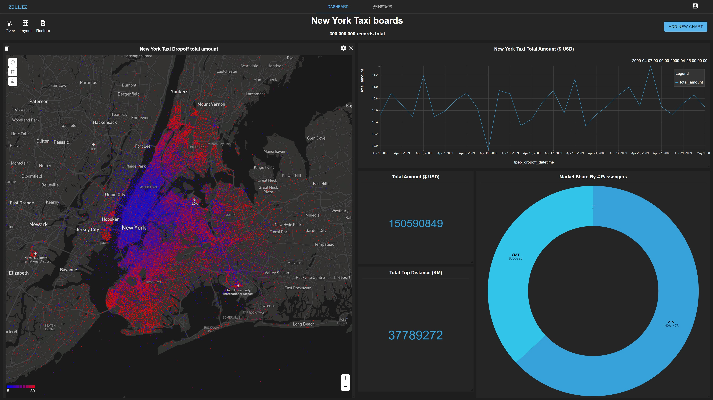
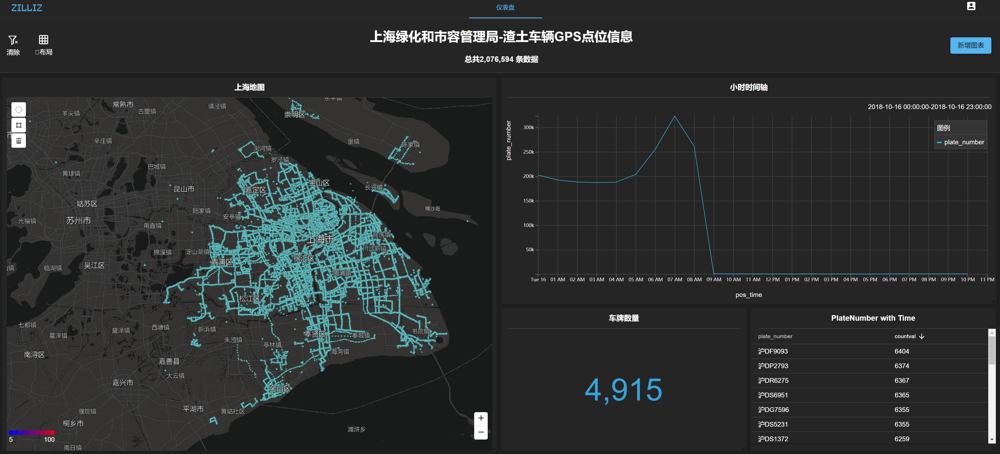
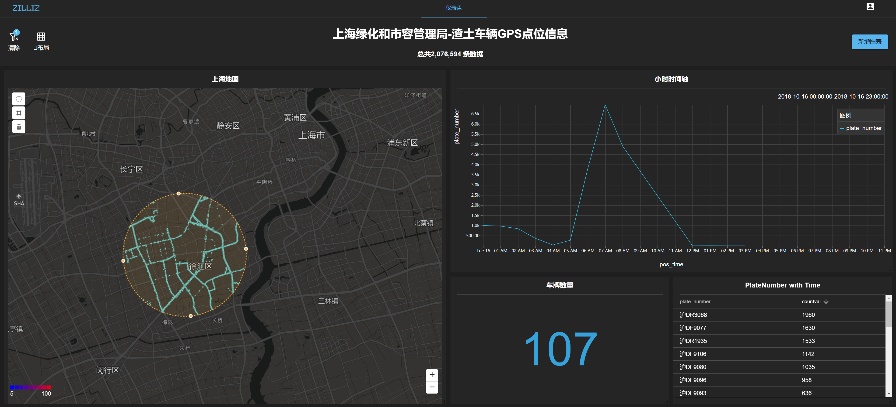
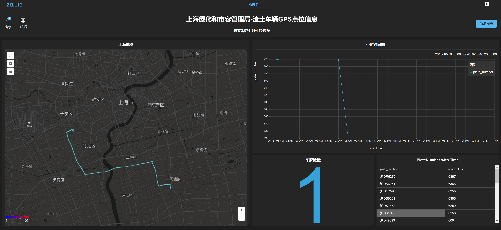

# 为物流行业领导者提供车辆信息分析平台 - Infini

# 概述

随着数字化的不断深入，“数据”在各行各业中所扮演的角色日益重要。特别是伴随革命性的 5G 通信技术，智能驾驶，智慧城市等技术的持续发展和广泛应用，这个时代的数据风暴正变得越来越猛烈，必然会为物流行业的数据分析带来全新的挑战：

- 数据量爆发式增长，2018 ~ 2025 数据量至少增长 6 倍
- 数据连接数量指数级，跨越式增长。4G 网络连接密度约 1,000 Connection / KM2 ， 5G 网络连接密度约 1,000,000 Connection / KM2

根据从大数据处理中得到的经验，倍增的数据，并无法带来倍增的价值。数据量越大，价值密度可能越低。另一方面，传统的计算引擎 CPU 的算力增长曲线已逐渐放缓， CPU 上的摩尔定律几近失效。继续用传统方法与工具进行数据分析处理，不论在性能，还是成本上都将使企业无法承受。

为帮助企业用户应对数据时代新的挑战， ZILLIZ 公司设计研发了新一代海量时空数据可视化分析引擎 Infini Analytics ，通过GPU加速的核心算法能够为物流行业的决策者提供针对时空信息数据流的实时可视化的分析能力，通过Inifini物流行业可视化面板，使得物流、交通运输、航运等行业的用户能够更有效的发现业务瓶颈、控制运营风险。

- 98%的物流服务商深信数据驱动的决策对整个行业的供应链至关重要
- 71%的航运服务商相信数据分析的实时性对运营至关重要
- 物流行业的最后一公里的运输成本占据了整体成本的30%

Infini时空数据分析平台为物流行业提供了从生产线到最后一公里的全供应链分析能力，为数据分析师提供了对数10亿行车辆运行数据和供应链管理数据进行实时分析的能力，在业务高峰时可视化您的运营情况，能够将实际可用库存、驾驶员的实时位置信息以及可选线路情况等进行交互式过滤分析，以简化您的运营操作确保一切按照计划准实完成。

- 通过综合分析各个销售点的实时销售信息以及仓库传感器的信息来预测货物的供给。
- 通过分析判断计划外的制造商或车队的维护需求以降低运营风险。
- 通过综合对比外部GPS信息，天气信息，道路维护信息，内部人员出勤信息以及车队运行信息来优化线路选择从而提高最后一公里的交付效率。

Infini Analytics具有完整的自主知识产权，并且率先使用图形处理单元（ GPU ）的大规模并行处理和视觉渲染能力进行数据可视化呈现。与传统方案相比， Infini Analytics 平台具备高吞吐、高性价比、低延时三重优势，单位算力成本降至传统方案的 10% 。用户可以对十亿级数据集进行查询和可视化交互，并获得秒内响应。

 **Infini Analytics 方案包括：**

 1. SQL 引擎 MegaWise
 2. Infini 图形渲染引擎
 3. 前端可视化组件

# SQL执行引擎: MegaWise

## 对 SQL 的原生支持

MegaWise 支持标准 SQL 和 PostgreSQL 语法，提供的查询速度比基于 CPU 的分析平台快一到两个数量级。 分析师和数据科学家可以依靠他们现有的 SQL 知识，通过以下方法对数据进行分析：

- 系统的可视化交互界面 （GUI）
- 命令行界面（ CLI ）
- API 库，目前支持 Python，Java，C++
- Java 数据库连接（ JDBC ）和开放式数据库连接（ ODBC ）

## 动态查询编译

MegaWise 是面向 CPU/GPU 异构计算体系结构设计的下一代数据分析平台。对上层应用支持常见的 SQL 分析操作，如过滤、聚合、连接，并提供领域加速算子，如地理信息分析、向量分析、时序分析等。

为了有效屏蔽算法实现的复杂性、计算设备的异构性，并充分挖掘硬件加速器的运算能力， ZILLIZ 在 MegaWise 平台中构建了基于 LLVM 的 JIT 编译系统。 LLVM 允许 MegaWise 将查询语句转换为独立于体系结构的中间代码，该中间代码可根据具体的执行硬件环境进一步生成目标代码，并面向硬件进行特定优化。这保证 MegaWise 具有良好的跨平台跨设备能力，当前 MegaWise 可在 NVIDIA GPU ，x64 CPU ，POWER CPU 和 ARM CPU 上高效运行。

MegaWise 的 JIT 系统同时提供了更快的编译速度，单条查询语句的编译时间在 **20 毫秒以下**。结合 MegaWise 的查询计划缓存系统，查询语句的平均编译时间通常在 **10 毫秒以内**。在 JIT 系统的有力支撑下，用户可以基于 SQL 进行便捷的自定义数据分析，并充分利用 CPU/GPU 所构成的混合异构运算能力，而不必关心底层硬件与算法实现的差异性。

## 多级数据缓存

MegaWise 对内存和计算层进行了深度优化，以提供极致性能。 MegaWise 在每个物理单节点内构建了 GPU 显存、主存、 SSD 三级缓存。根据数据热度及运算局部性，完成对数据的智能放置。需要被 GPU 频繁、连续处理的热数据，将被保存在 GPU 显存中，避免通过 PCIe 总线移动数据，以实现最快的访问速度。 MegaWise 还可以利用 NVIDIA NVLink 技术加速 CPU 到 GPU 的数据传输，速度比没有 NVLink 的系统快 2.5 倍，该特性在可在 IBM OpenPOWER 服务器上使用。

MegaWise 的缓存系统同时提供与外部系统进行数据交互的能力。数据格式全面兼容 Apache Arrow 标准，在 GPU 显存、主存两个内存层均可实现对外数据交换，并支持零拷贝数据传输模式。

## 矢量化查询与混合执行

支撑 MegaWise 超高性能的另一个重要特性是查询执行的高度矢量化。 矢量化代码允许处理器同时计算众多数据项。当前的 GPU 单卡内通常包含数以千计乃至数以万计的运算执行单元，这意味着 GPU 中的矢量化查询可在单周期并行处理数千个数据项，相较 CPU 方案，数据处理的并发度提升两到三个数量级。

MegaWise 的矢量化查询技术可以同时应用到 CPU 。现代 CPU 普遍提供了向量扩展指令集，内部集成了可并行处理多个数据项的宽字执行单元。MegaWise 的 SQL Engine 可同时驱动多个 GPU 和 CPU 进行矢量化查询，即便在 CPU 中，在应用矢量化查询后，相较传统多线程方案也有显著的性能提升。

## 终结复杂索引、降采样、预聚合

传统的分析平台在设计之初，并未考虑到当今大数据的数据量、分析算法的复杂度，或决策的速度。随着这些主流分析工具在大型数据集的重压下开始崩溃，传统的数据仓库采用了索引、降采样或预聚合等技术，以支撑大规模数据分析的性能。

相比之下， MegaWise 平台充分发挥 GPU 等硬件加速器的硬件红利，可实现巨大性能提升。通过软硬件一体化融合， MegaWise 可以提供即时查询，而无需事先构建索引、降采样或预聚合，即使面向十亿级数据记录也可以达到几十到几百毫秒的响应速度。

避免构建复杂索引、降采样和预聚合主要带来两点优势。首先，部署 MegaWise 的用户不需要花费大量时间和资源来建模数据，只需完成数据导入即可享受到实时 SQL 查询。其次，只保留对数据的轻量预处理意味着 MegaWise 可以更快速的加载数据，这对于流数据处理场景及高频数据处理场景尤为重要。

## 性能/性价比分析

以下测试中用到的数据与查询语句来自纽约出租车历史订单（共 11 亿笔订单）。

### 单节点 MegaWise 对比其他集群产品

- 测试环境

|              | 物理节点数 | CPU 总数 | GPU 总数 | 内存总容量（GB） | SSD 磁盘容量（TB） |
| :------------: | ----------: | --------: | --------:| ---------------- | ------------------: |
| MegaWise     | 1          | 48       | 1        | 256              | 0.5                |
| Redshift     | 6          | 192      | 0        | 1464             | 15.4               |
| Spark 2.4    | 21         | 84       | 0        | 315              | 1.7                |
| Presto 0.214 | 21         | 84       | 0        | 315              | 1.7                |

> 友商数据引用自：https://tech.marksblogg.com/benchmarks.html

- 性能数据

|              | Q1   | Q2   | Q3   | Q4    |
| :------------: | ----: | ----: | ----: | -----: |
| MegaWise     | 1.82 | 1.69 | 1.81 | 2.81  |
| Redshift     | 1.56 | 1.25 | 2.25 | 2.97  |
| Spark 2.4    | 2.36 | 3.56 | 4.02 | 20.4  |
| Presto 0.214 | 3.54 | 6.29 | 7.66 | 11.92 |

> 友商数据引用自：https://tech.marksblogg.com/benchmarks.html

### 单节点 MegaWise 对比其他单节点产品

- 测试环境

|               | 物理节点数 | CPU 总数 | GPU 总数 | 内存总容量（GB） | SSD 磁盘容量（TB） |
| :------------: | ----------: | --------: | --------:| ---------------- | ------------------: |
| MegaWise      | 1          | 48       | 1        | 256              | 0.5                |
| Oracle 12.2   | 1          | 48       | 0        | 256              | 2.0                |
| PostgreSQL 10 | 1          | 128      | 0        | 1024             | 3.0                |

> 友商数据引用自：https://tech.marksblogg.com/benchmarks.html

- 性能数据

|              | Q1   | Q2   | Q3   | Q4    |
| :------------: | ----: | ----: | ----: | -----: |
| MegaWise     | 1.82 | 1.69 | 1.81 | 2.81  |
| Oracle 12.2     | 213.82 | 174.59 | 174.81 | 173.84  |
| PostgreSQL 10   | 56.55 | 56.92 | 89.90 | 94.37  |

> 友商数据引用自：https://tech.marksblogg.com/benchmarks.html

# 图形渲染引擎： Picasso 

## 服务器端渲染

在传统的可视化数据交互系统中，web 端可视化系统通过 JDBC 等接口连接数据库查询引擎，将查询结果传输到前端进行数据栅格化，并同过交互界面展示。这类解决方案面向小数据集工作良好，但在应对海量数据时难以满足数据分析与数据交互的实时性需求。

传统解决方案在多个环节存在问题：

- 数据库需要将结果通过网络传输到前端，在现有网络技术条件下，传输亿级结果需要几秒甚至几分钟的时间。
- 当下流行的前端渲染系统支持的数据规模在十万级，在功能上无法满足海量数据可视化交互的需求。

Infini Analytics 采用更为先进的服务器端渲染技术， SQL 引擎与渲染引擎均采用 GPU 加速，并已实现无缝整合。 SQL 引擎在完成查询分析任务后，调度系统随即将 GPU 计算资源及 GPU 内数据直接调度至渲染引擎。 Infini Analytics 的解决方案直接避免了数据的传输，查询分析与图像渲染两个阶段间实现了数据零拷贝。此外，大量的查询结果数据在 GPU 内已经由渲染引擎栅格化为图片，服务器端只需向 web 前端传输图片，与直接传输结果数据的方案相比，数据传输量降至 1% 以下。

在数据栅格化的过程中， Infini 图形渲染引擎可充分利用 GPU 内所有的渲染管线，与 web 前端的渲染技术相比，渲染并发度提升三个数量级，亿级数据的渲染速度仍可保证在 100 毫秒以内。

## Vega 描述语言

Vega 描述语言由著名游戏引擎 D3 的创建者开发，旨在对复杂的渲染计划进行准确描述。 Infini 图形渲染引擎完整兼容 Vega 语法。 Infini 的前端可视化组件以及用户的第三方可视化系统均可通过 Vega 接口与 Infini 图形渲染引擎交互。

通过 Vega 语言，上层应用可向 Infini 图形渲染引擎发出散点图、热力图、线段、多边形等多类渲染任务。同时， Infini 图形渲染引擎还内置丰富的数据可视化渲染方式，方便用户快速完成定制化开发。

## 性能分析

|points(K) | t_trans(ms) | t_echarts_render(ms) | echarts(ms) | gis(ms)|
| :----: | ----: | ----: | ----: | ----:|
|1|59|1200|1259|669                                        |
|2|52|1500|1552|651                                        |
|4|93|2000|2093|636                                        |
|8|177|1220|1397|632                                        |
|16|340|2400|2740|611                                        |
|32|668|4000|4668|600                                        |
|64|1362|7200|8562|837                                    |
|128|2770|16300|19070|704                                |
|256|5438|40000|45438|757                                |
|512|8902|NAN|NAN|985                                        |

>- t_trans 、 t_echarts_render 、 echarts 三列为前端渲染方案的执行时间
>- t_trans 为数据从后台数据库发送到前端的时间
>- t_echarts_render 为 echarts 渲染时间
>- echarts 为 echarts 方案数据传输与渲染时间之和
>- gis 为 Infini 方案渲染与数据传输时间之和

# 可视化组件： Infini

前端组件基于 React 构建，各类图表基于 D3 开发。用户可以灵活配置各个图表，支持针对多列数据进行聚合或者过滤。通过我们特有的 crossfilter sql 生成功能，用户可以进行多 chart 交互操作，并实时更新图表。

目前支持 9 种图表类型，每种图表超过 10 种自定义配置（包括颜色、显示格式等）。

# 时空分析案例

## 纽约出租车

以下案例使用的数据来自开源数据集。

- 汇总分析纽约出租车数年的订单情况（超过3亿笔）

  
  > - 地图定位按订单到达位置显示
  > - 数据点按订单金额着色，越红代表订单金额越高

- 缩放地图，分析指定区域的订单情况
  
  
  
- 按时间窗口与车辆运营商进行分析过滤
  
  
以上分析模式，非常适合类似行业的时空数据分析场景，如快递、物流行业的每月快递信息分析，能够对数亿快递信息进行图像化交互式分析，从而有效实现资源优化配置、优化定价模型等业务分析需求。

## 上海市渣土车 GPS 轨迹

以下案例使用的数据来自上海市政府公开数据。

- 上海市所有渣土车在一天内的 GPS 定位点（超过200万个定位点）

- 分析指定时间段，指定区域内的渣土车行驶情况。

- 分析某一具体车辆的行驶轨迹

# 总结

新的数据时代，带来新的挑战。传统分析方法与框架面临性能与成本的双重困境。 Infini Analytics 能极大的提升用户对海量结构化数据和时空数据的分析能力。在成本可控的前提下，充分挖掘爆发式增长的数据中蕴含的新价值，为物流行业的领导者们提供了一个分析超大规模车辆运行信息的分析平台：

- 提高准实交付率
- 通过机器学习算法优化投递路线
- 对车辆运行信息进行全方位的分析
- 监控司机行为
- 实施基于状态的维护

Infini提供了能够解决物流行业各种大数据数据分析需求的统一平台：

- 通过GPU加速数据查询和数据可视化的的能力
- 提供了对超大规模时空信息分析的能力远超传统GIS解决方案
- 让大数据变得可视化、更及时、更直观
- 让所有用户能够接近零学习成本轻松上手

以上各种优势综合起来加速信息处理，从而更好为物流行业的领导者们提供更好的决策支持。

更多信息欢迎访问我们的网站：https://infini-analytics.github.io/
